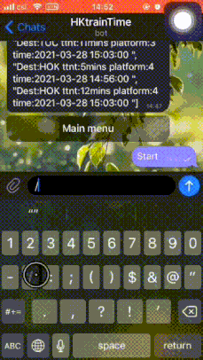

Hong Kong MTR Telegram Bot
--------------------------
*Unofficial*

# Usage example

# Motivation
My neighborhood train station has 2 different lines that both take me to Central station in downtown Hong Kong.
However, these 2 lines are on different floors of the station and it takes a few minutes to go from one to the other.
Knowing the schedule in real-time would be convenient to decide where to go and how fast to walk or run.

HKMTR has already developed a [standalone MTR app](http://www.mtr.com.hk/mtrmobile/en/)
but I don't like installing more apps and potentially granting permissions.
So, instead, I made this Telegram bot.

# How to use this program?
1) Install Telegram app in your phone
2) Subscribe to @HKtrainTime_bot in Telegram app
3) Type "/start" into the chatbox and start using!

# Data
I used the following websites as my starting point:
* https://data.gov.hk/en-data/dataset/mtr-data2-nexttrain-data
* https://opendata.mtr.com.hk/doc/Next_Train_API_Spec_v1.1.pdf

Take note that there are only 4 train lines available in MTR's API although there are [10 main local lines](http://www.mtr.com.hk/en/customer/services/system_map.html)
running in Hong Kong SAR.
And, obviously, my bot can only support what the API provides.

# Known issues
* Due to inline keyboard, the bot won't appear as last message in Telegram unless you type /start, pin it on the chat, or bump it in some other way.
* Code works but doesn't look elegant.
